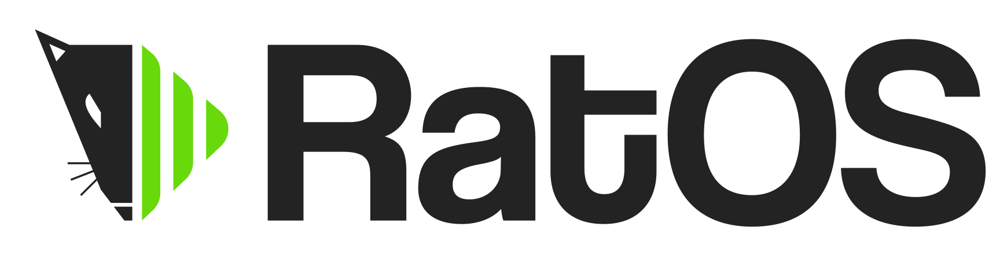

[](http://discord.gg/ratrig)

# What is RatOS

RatOS is a preconfigured Raspberry Pi image that aims to make it as painless as possible to get Klipper, Mainsail and Moonraker up and running on your printer. It is developed and maintained by Mikkel Schmidt (miklschmidt#2036 on the Rat Rig Unofficial Discord) with help from the community.

# How to use RatOS

Start by reading the [Documentation](https://os.ratrig.com)

# Build your own / Developing

## Requirements

- [qemu-arm-static](http://packages.debian.org/sid/qemu-user-static)
- [CustomPiOS](https://github.com/guysoft/CustomPiOS)
- [Downloaded Raspbian Image](http://www.raspbian.org/)
- Bash
- Git
- [Docker](https://docs.docker.com/engine/install/ubuntu/)
- [Docker-Compose](https://docs.docker.com/compose/install/)
- QEMU for emulation
- About 5GB of free diskspace for the build
- Yarn & Docsify for docs

### Packages for Ubuntu 18.04/20.04

** Dekstop variants are known to cause issues during build due to snaps takeing up loop mounts **

```bash
sudo apt-get install gawk make build-essential util-linux \
qemu-user-static qemu-system-arm \
git p7zip-full python3 curl
```

## Compiling source

```bash
git clone https://github.com/Rat-Rig/RatOS.git
cd RatOS/
make build
```

### Other make options

```bash
make clean - Clean all previous build items except the source raspian image
make distclean - Clean up the source image and trigger a new download
```

### Build layout

RatOS/emulation - Contains dependencies for emulation testing  
RatOS/src/image - Contains our base raspbian image  
RatOS/src/workspace - Created during build, and output for compiled images
