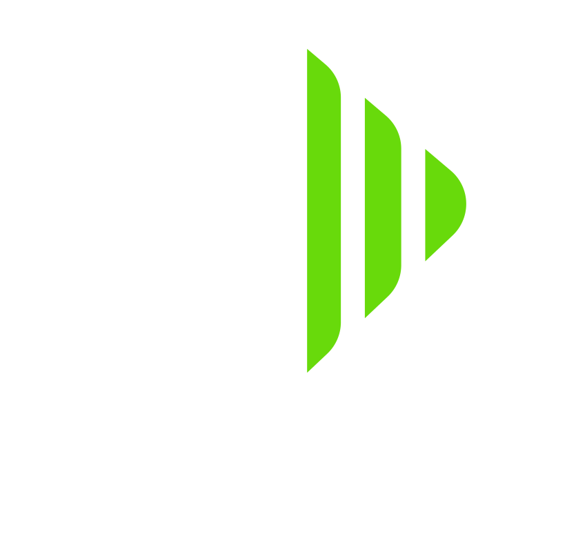

# <small>Formerly known as **V-CoreOS**</small>

 

> The easy way to run klipper on your 3D printer.

- · Modular configuration with support for multiple printers
- · Supports multiple controller boards, extruders and hotends
- · Automatic firmware compilation and MCU flashing
- · Based on Klipper, Moonraker and Mainsail

[Download](https://github.com/Rat-OS/RatOS/releases)
[Documentation](#introduction)
