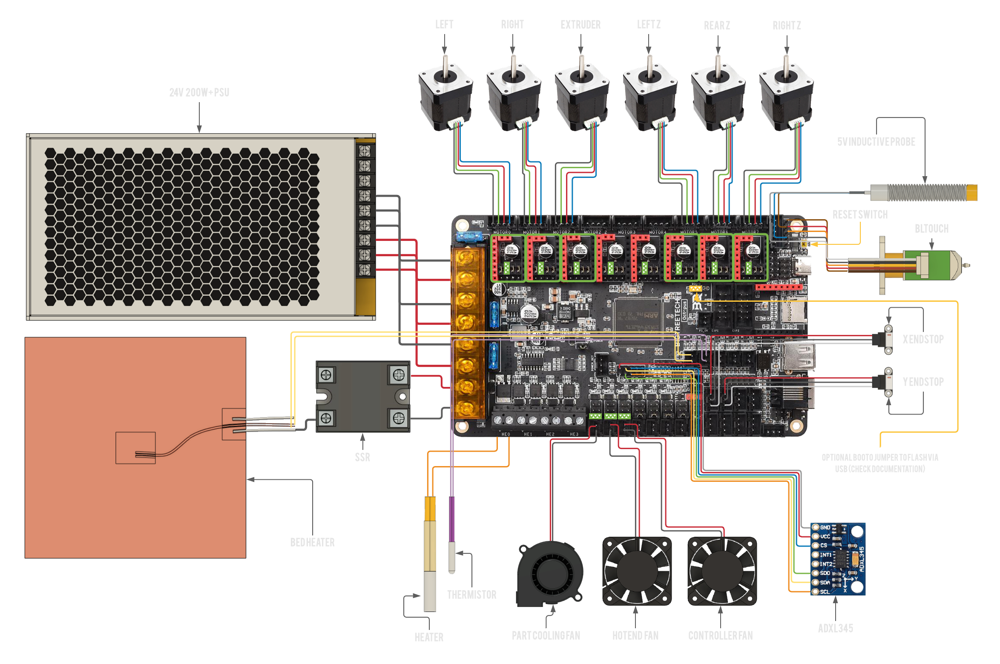

# Big Tree Tech Octopus Pro STM32F429

## Wiring

!> If you use the Ratrig endstop switches and cables, do **not** blindly plug them in to your Octopus Pro 429 as doing this will short the board's 5V supply rail. You will probably have to swap the outer two wires (red and white) on the board end of the cable but double check this.

## Firmware installation

!> Make sure your board is connected to the Pi **via the provided USB-C cable** (USB-C on the Octopus Pro 429, USB-A on the Pi).

Move the `firmware-octopus-pro-429.bin` file from the release page to the SD card that goes into your control board and call it `firmware.bin`, then insert the SD card in to the control board.

?>
You can verify if the board flashed correctly by checking if the firmware.bin file has been changed to firmware.CUR on the SD card. If you have trouble flashing the motherboard, start unplugging your wires beginning with the endstops, sometimes faulty wiring can cause the board to not boot properly.

?> Once you have verifed the board has been succesfully flashed, **DO NOT** reinsert the SD card. If you do, the automatic firmware updates won't work.

If you're going through initial setup please continue in the [installation guide](installation.md#setup)

## Manual firmware upgrade

Sometimes klipper makes changes to the microcontroller code and thus your MCU need to be reflashed with new firmware. You can do that in 2 ways.

!> RatOS V1.0-RC3 automatically flashes the newest firmware to your
Octopus Pro 429 when klipper is updated (if the klipper firmware has previously been flashed).
You shouldn't need any of the steps below unless that fails.

### SD Card

If you're not used to the command line or haven't used SSH before, the easiest way is to download the firmware file from Mainsail and put that onto an SD card (renaming it to firmware.bin). Everytime klipper is updated, the firmware for the connected board is compiled and put into the `firmware-binaries` folder which you can find under the "Machine" tab. The process for this is the same as in the [Firmware Installation](#firmware-installation) step.

?>
You can verify if the board flashed correctly by checking if the firmware.bin file has been changed to firmware.CUR on the SD card. If you have trouble flashing the motherboard, start unplugging your wires beginning with the endstops, sometimes faulty wiring can cause the board to not boot properly.

?> Once you have verifed the board has been succesfully flashed, you don't have to reinsert the SD card.

### Flashing via USB

Another option is to SSH into the pi using something like PuTTy or `ssh pi@RatOS.local` via the commandline on OS X and Linux machines. Execute `~/klipper_config/config/boards/btt-octopus-pro-429/make-and-flash-mcu.sh` and the Pi will compile the klipper firmware and flash the board for you.

!> Be sure to remove the SD card from the board before attempting to flash, if one is in there.
