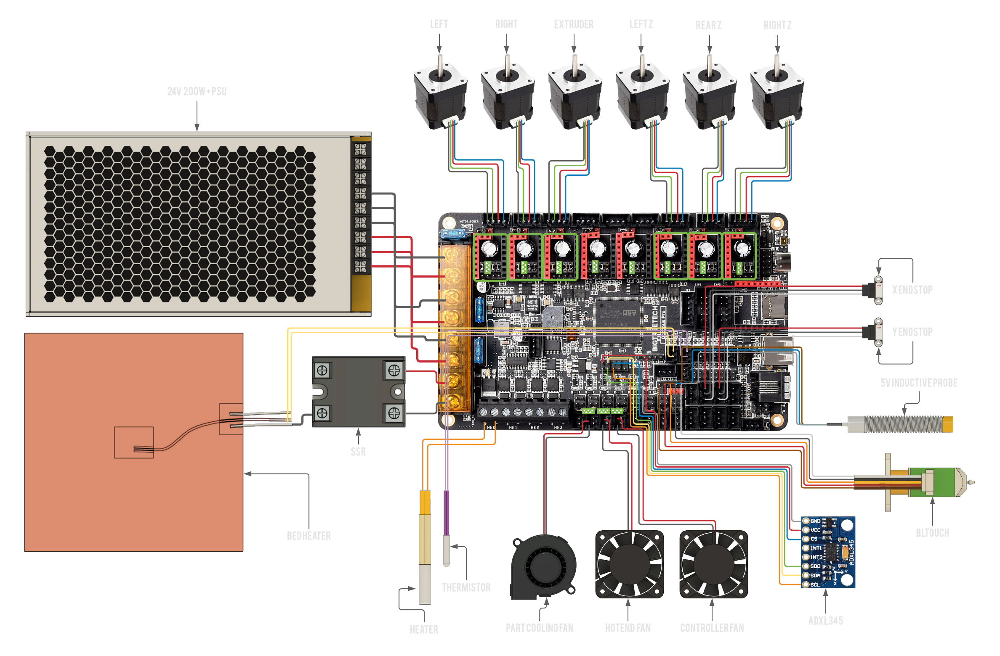

# BIGTREETECH Octopus Pro STM32F429

:::caution Only Partial support
This board is currently not recommended, as it cannot be flashed automatically through USB, that means all firmware updates have to be done by manually moving an SD card back and forth. It is recommended to get the Octopus Pro 446 instead. RatOS compiles the firmware binary for you each time klipper is updated (while the Octopus Pro 429 is connected), you can find the most recent firmware in the Mainsail Machine page under the `firmware_binaries` folder). Automatic flashing may be possible in the future if SDIO support is implemented in klipper. See this thread: https://github.com/Klipper3d/klipper/pull/4881#issuecomment-962596510 for more info.
:::

## Wiring

[Open Full Size Image](_media/octopus-pro-wiring-full.png)

:::danger if you use the Ratrig endstop switches and cables, do **not** blindly plug them in to your Octopus as doing this will short the board's 5V power rail.
You will probably have to swap the outer two wires (red and white) on the board end of the cable but double check to make sure your cables match the wiring diagram.
:::

:::info Jumpers
 A green square with triangles inside is where you would place a jumper,
remove all jumpers on the board that are not marked by this symbol.
:::

## Firmware installation

:::caution Use a proper cable
Make sure your board is connected to the Pi **via the provided USB-C cable** (USB-C on the Octopus Pro 429, USB-A on the Pi).
:::

Download the `firmware-btt-octopus-pro-429.bin` from the `firmware_binaries` folder found on the Machine page of [Mainsail](http://RatOS.local/), copy it onto the SD card that goes into your control board and call it `firmware.bin`, then insert the SD card in to the control board. Here are the steps in chronological order:

1.  Navigate to [http://RatOS.local/](http://RatOS.local/)
2.  Open Machine page
3.  Open `firmware_binaries` folder
4.  Download `firmware-btt-octopus-pro-429.bin`
5.  Format the sd card for your board to FAT16 (sometimes just called FAT), or FAT32 with a clustersize of 8kb or 4kb.
6.  Copy `firmware-btt-octopus-pro-429.bin` onto the sd card for your board
7.  Rename `firmware-btt-octopus-pro-429.bin` to `firmware.bin`
8.  Safely eject the SD card through your operating system.
9.  Physically take out the sd card and insert it into your control board.
10. Power cycle your printer or control board. Remember to shut the pi down properly before you cut power to your Pi (you can do that through Mainsail using the dropdown menu in the top right corner).
11. Verify that the firmware has been flashed

:::tip
You can verify if the board flashed correctly by checking if the firmware.bin file has been changed to firmware.CUR on the SD card. If you have trouble flashing the motherboard, start unplugging your wires beginning with the endstops, sometimes faulty wiring can cause the board to not boot properly.
:::

If you're going through initial setup please continue in the [installation guide](installation.md#setup)

## Manual firmware upgrade

Sometimes klipper makes changes to the microcontroller code and thus your MCU need to be reflashed with new firmware.

:::info
RatOS automatically compiles new firmware for your board when klipper is updated and places it in the firmware_binaries folder, you can download the binary from here and flash via SD card manually.
:::

### SD Card

Everytime klipper is updated, the firmware for the connected board is compiled and put into the `firmware-binaries` folder which you can find under the "Machine" tab. The process for this is the same as in the [Firmware Installation](#firmware-installation) step. Download the firmware file from Mainsail and put that onto an SD card (renaming it to firmware.bin) and insert it into your board, then power it on.

:::info
You can verify if the board flashed correctly by checking if the firmware.bin file has been changed to firmware.CUR on the SD card. If you have trouble flashing the motherboard, start unplugging your wires beginning with the endstops, sometimes faulty wiring can cause the board to not boot properly.
:::

## I updated klipper and now i get an error!

When you update klipper you might see an error that looks like this:

This is because klipper made changes to a part of the MCU firmware that we use, and the Octopus Pro 429 cannot be flashed automatically over USB. Klipper is telling us that the version of klipper running on the Pi is newer than the version running on the MCU. To fix this, we have to flash the board with a new version of the firmware. For convenience, and ease of use, the newest firmware is compiled and put in the firmware_binaries folder which you can find in the `MACHINE` tab in Mainsail. You can use this to flash your MCU the same way you did initially, via SD Card.
