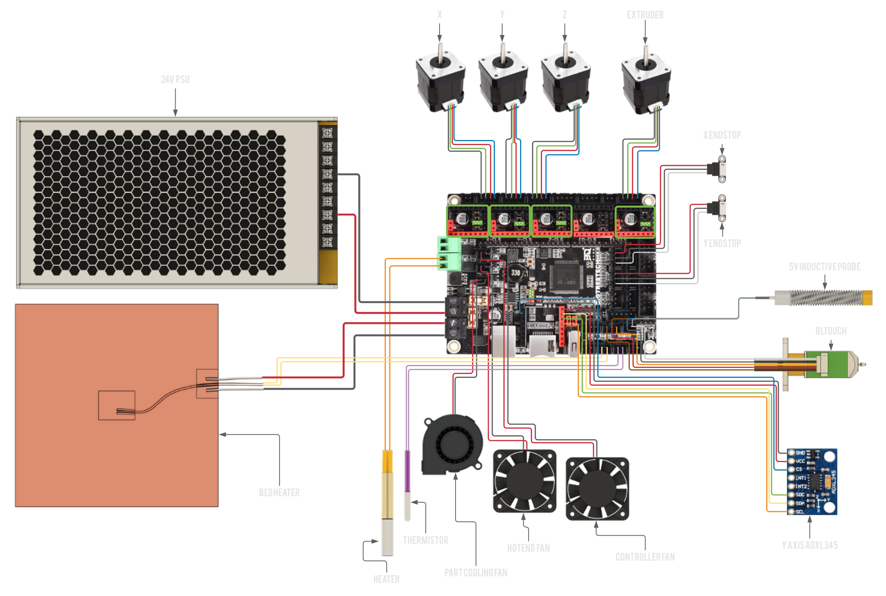

# BIGTREETECH SKR 2 w/ STM32F429

:::caution Only Partial support
This board currently cannot be flashed automatically through USB, that means all firmware updates have to be done by physically moving an sd card from and to the board for now. RatOS compiles the firmware binary for you each time klipper is updated (while the SKR 2 is connected), you can find the most recent firmware in the Mainsail Machine page under the `firmware_binaries` folder). Automatic flashing may be possible in the future if SDIO support is implemented in klipper. See this thread: https://github.com/Klipper3d/klipper/pull/4881#issuecomment-962596510 for more info.
:::

## Wiring

[Open Full Size Image](_media/skr-2-429-wiring-full.svg)

:::danger if you use the Ratrig endstop switches and cables, do **not** blindly plug them in to your SKR 2 as doing this will short the board's 5V power rail.
You will probably have to swap the outer two wires (red and white) on the board end of the cable but double check to make sure your cables match the wiring diagram in both ends.
Orders shipped after October 2022 should have the correct cables (the connectors on the new cables are white).
:::

:::info Jumpers
 A green square with triangles inside is where you would place a jumper,
remove all jumpers on the board that are not marked by this symbol.
:::

## Firmware installation

:::caution Use a proper cable
Make sure your board is connected to the Pi **via the provided USB cable** (USB-B on the SKR 2 429, USB-A on the Pi).
:::

Follow the steps in the RatOS Configurator at [http://RatOS.local/configure?step=1](http://RatOS.local/configure?step=1).

## I updated klipper and now i get an error!

When you update klipper you might see an error that looks like this:

This is because klipper made changes to a part of the MCU firmware that we use, and the SKR 2 cannot be flashed automatically yet. Klipper is telling us that the version of klipper running on the Pi is newer than the version running on the MCU. To fix this, we have to flash the board with a new version of the firmware, Follow the steps in the RatOS Configurator at [http://RatOS.local/configure?step=1](http://RatOS.local/configure?step=1).
