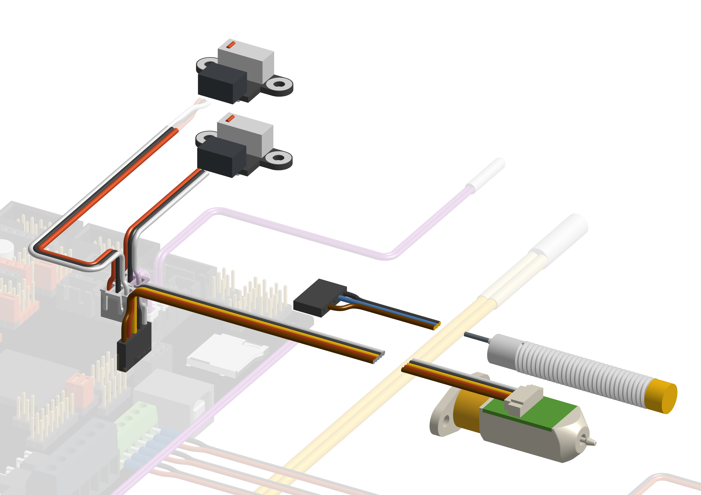

# BIGTREETECH SKR Pro v1.2

## Jumper configuration

## Stepper Pins

:::info
To use physical endstops on the SKR Pro you need to cut the diag pins from your X and Y stepper drivers. This will prevent you from using sensorless homing. If you later change your mind, you can swap X and Y with 2 of the Z steppers.

:::

## Wiring

:::danger if you use the Ratrig endstop switches and cables, do **not** blindly plug them in to your SKR Pro 1.2 as doing this will short the board's 3.3V power rail.
You will probably have to swap the outer two wires (red and white) on the board end of the cable but double check to make sure.
:::

## Zoomed view of VIN

## Zoomed view of endstops and probes

:::info Inductive Probes
You can optionally use an inductive probe, in that case the BLTouch header can be used as shown below. 6V - 36V probes will require custom wiring - do not plug more than 5V into the signal pin on the board.
:::

## ADXL345

:::info
In Klipper you can use an ADXL345 accelerometer chip to automatically tune your Input Shaper settings. This works out of the box in RatOS if you wire it to the SPI port on the far right side of the SKR Pro 1.2.
:::

## Firmware installation

Follow the steps in the RatOS Configurator at [http://RatOS.local/configure?step=1](http://RatOS.local/configure?step=1).

## I updated klipper and now i get an error!

When you update klipper you might see an error that looks like this:

This is because klipper made changes to a part of the MCU firmware that we use, and something went wrong while automatically flashing your board. Klipper is telling us that the version of klipper running on the Pi is newer than the version running on the MCU. To fix this, we have to flash the board with a new version of the firmware, Follow the steps in the RatOS Configurator at [http://RatOS.local/configure?step=1](http://RatOS.local/configure?step=1).
