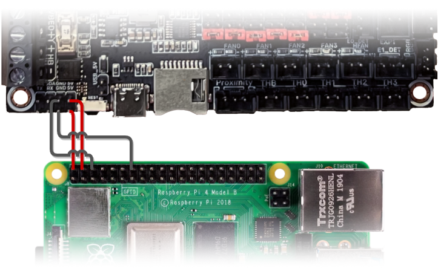

import WiringSVG from "./_media/skrat-10-wiring.svg";
import FanSVG from "./_media/skrat-10-fan-wiring.svg";

# BIGTREETECH SKRat v1.0

## Wiring

<WiringSVG width="100%" height={null} />

[Open Full Size Image](_media/skrat-10-wiring.svg)

:::danger if you use the Ratrig endstop switches and cables, do **not** blindly plug them in to your SKRat as doing this will short the board's 5V power rail.
You will probably have to swap the outer two wires (red and white) on the board end of the cable but double check to make sure your cables match the wiring diagram in both ends.
Orders shipped after October 2022 should have the correct cables (the connectors on the new cables are white).
:::

:::info Jumpers
A green square is where you would place a jumper, remove all jumpers on the board that are not marked by this symbol.
:::

### FAN Wiring

<FanSVG width="100%" height={null} />

[Open Full Size Image](_media/skrat-10-fan-wiring.svg)

:::caution Verify wire colors
The fan wire colors in this diagram might not match the colors of the wires on your particular fan. Always refer to the spec sheet of your fan to make sure you're connecting your fan correctly.
:::

:::danger Fan Voltage
**Always** remember to set the voltage selector correctly for the fan you're using.
:::

The SKRat supports both 2-pin and 4-pin fans. Since there's only 2 4-pin fan headers, you can only run either the Hotend or the Controller as a four pin fan besides the Part Cooling Fan. You can mix and match as you like. **Always** remember to set the voltage selector correctly for the fan you're using.

### Powering the Raspberry Pi

[Open Full Size Image](_media/skrat-10-pi-wiring.png)

:::tip Use a 2x5 dupont connector
You can use a 2x2 and 2x5 dupont connector to make a solid and reliable connection between the Pi and the SKRat.
:::

## Firmware installation

Follow the steps in the RatOS Configurator at [http://RatOS.local/configure?step=1](http://RatOS.local/configure?step=1).

## I updated klipper and now i get an error!

When you update klipper you might see an error that looks like this:

This is because klipper made changes to a part of the MCU firmware that we use, and something went wrong while automatically flashing your board. Klipper is telling us that the version of klipper running on the Pi is newer than the version running on the MCU. To fix this, we have to flash the board with a new version of the firmware, Follow the steps in the RatOS Configurator at [http://RatOS.local/configure?step=1](http://RatOS.local/configure?step=1).
