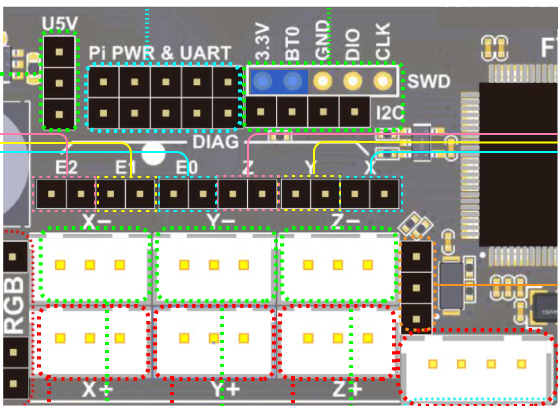

# Fysetc Spider v1.1

## Wiring


:::danger If you use the Ratrig endstop switches and cables, do **not** blindly plug them in to your Spider as doing this will short the board's 3.3V power rail.
You will probably have to swap the outer two wires (red and white) on the board end of the cable but double check to make sure.
:::

:::caution
If you have been testing your Spider without the stepper drivers plugged in, there is a chance that you'll blow the 3.3V voltage regulator on the board if you do not discharge the capacitors before connecting the drivers. The lesson here is don't power up the Spider without the stepper drivers plugged in. Please read https://github.com/FYSETC/FYSETC-SPIDER/blob/main/Spider%203.3v%20issue.md
:::

:::caution
Before connecting a probe **check** the probe voltage selector jumper.
:::


### Connection to your Pi

While the Spider can connect to your Pi via it's UART this is not
supported by V-Core OS as standard and will require manual firmware
configuration.

The normal V-Core OS connection is via USB as this allows new versions
of Klipper to be uploaded without needing an SDCard. You can, of
course, power the Pi from your Spider whichever form of connection you
use or if you use a dedicated Pi Power Supply you can shut down your
Spider while leaving the Pi running.

## Firmware installation

For the first time install of Klipper onto the Spider; there are two
methods. With an SD Card or via SSH(PuTTY)/USB.

The SD Card method is suggested as being the
easiest.

### Flash via SD Card (recommended)

Download the `firmware-fysetc-spider.bin` from the `firmware_binaries` folder found on the Machine page of [Mainsail](http://RatOS.local/), copy it onto the SD card that goes into your control board and call it `firmware.bin`, then insert the SD card in to the control board. Here are the steps in chronological order:

1.  Navigate to [http://RatOS.local/](http://RatOS.local/)
2.  Open Machine page
3.  Open `firmware_binaries` folder
4.  Download `firmware-fysetc-spider.bin`
5.  Format the sd card for your board to FAT16 (sometimes just called FAT), or FAT32 with a clustersize of 8kb or 4kb.
6.  Copy `firmware-fysetc-spider.bin` onto the sd card for your board
7.  Rename `firmware-fysetc-spider.bin` to `firmware.bin`. Please be wary of file extensions! If the file doesn't already show .bin, don't add it!
8.  Safely eject the SD card through your operating system.
9.  Physically take out the sd card and insert it into your control board.
10. Power cycle your printer or control board. Remember to shut the pi down properly before you cut power to your Pi (you can do that through Mainsail using the dropdown menu in the top right corner). The upload should take a few seconds and a LED by the SDCard slot should flash while this is happening.
11. Verify that the firmware has been flashed and **Do not put the sd card back in the board after successful flashing**.

For more information; this is documented on the Fysetc pages:
https://github.com/FYSETC/FYSETC-SPIDER#42-Klipper

:::tip
If you don't know how to make Windows Explorer show file extensions, see [this article on HowToGeek](https://www.howtogeek.com/205086/beginner-how-to-make-windows-show-file-extensions/)
:::

:::caution
If you have an ADXL345 connected to your Spider as shown below, you may need to disconnect it from your Spider to avoid conflicts with the SD Card while loading the firmware.
:::

### First time flashing via SSH(PuTTY)/USB

While the SD Card method described above is the easiest, users that are
comfortable with SSH/PuTTY may prefer this more advanced method.

Fysetc provide instructions on installing Klipper here:
https://github.com/FYSETC/FYSETC-SPIDER#42-Klipper but some parts of
that are less clear than one might wish so here is the sequence that
worked for the author.

Make sure your board is connected to the Pi (USB-C on the Spider, USB-A
on the Pi). Connect with SSH (PuTTy for Windows users) to the Pi (login
pi, password raspberry if you did not change the defaults).



Connect a jumper between 3.3V and BT0 on the Spider as shown above.

Press the reset button on the Spider.

On the Pi, run the following command:

    dfu-util --list

You should see a list of DFU devices. This is your Spider ready to have
the firmware uploaded.

Build the firmware which is covered here: [Manual Firmware Compilation](manual-firmware-compilation.md)

Once the firmware is built on the Pi run:

    sudo service klipper stop
    dfu-util -a 0 -s 0x08000000:leave -D ~/klipper/out/klipper.bin

You should see the firmware being written to your Spider.

Now remove the jumper between 3.3V and BT0 on the Spider. Press the reset button on the Spider.

Run "lsusb" on the Pi and you should see a device by the name "OpenMoko, Inc.". This is your Spider running Klipper.

run the command "sudo service klipper start". RatOS should now be able to communicate with your Spider.

### Klipper Updates

:::info Automatic firmware updates
RatOS automatically flashes the newest firmware to your
Spider v1.1 when klipper is updated (if the klipper firmware has previously been flashed).
You shouldn't need any of the steps below unless that fails.
:::

Sometimes klipper makes changes to the microcontroller code and thus
your Spider need to be reflashed with new firmware. You can do that in 2
ways.

The updates can be installed with an SD Card (same method as
the first install described above) or over a Pi/Spider USB connection from RatOS
using SSH(PuTTY) and the provided
~/klipper_config/config/boards/fysetc-spider/make-and-flash-mcu.sh
command so you don't need to fiddle around with SD Cards.

## Setup

If you're going through initial setup please continue in the [installation guide](installation.md#setup)

## ADXL345 Connection

In your printer.cfg uncomment the following:

    #   For ADXL345
    [resonance_tester]
    accel_chip: adxl345
    # Change the following to the centre of your bed.
    probe_points: 200,200,20

Connect the ADXL345 to the Spider like so:

    Spider         ADXL345
    5V             VCC
    GND            GND
    MISO           SDO
    MOSI           SDA
    SCK            SCL
    CS             CS


See the Fysetc wiring plan for details: https://github.com/FYSETC/FYSETC-SPIDER/blob/main/images/Spider_V1.0_Pinout.jpg

:::info
You might have to disconnect the ADSL345 from your Spider while you are uploading firmware using the SD Card.
:::

### Undervoltage errors

If you are using the Fysetc TMC2209 step-sticks and you're getting Undervoltage errors from the stepper drivers make sure to either fully disable or enable stealthchop.

To completely disable stealthchop add this to the "### USER OVERRIDES" section of printer.cfg for each driver on your printer:

```properties
    [tmc2209 stepper_x]
    stealthchop_threshold: 0
```

You can also enable stealthchop instead, like so:

```properties
    [tmc2209 stepper_x]
    stealthchop_threshold: 9999999
```

Klipper recommends using either stealthchop or spreadcycle for TMC drivers: https://www.klipper3d.org/TMC_Drivers.html
