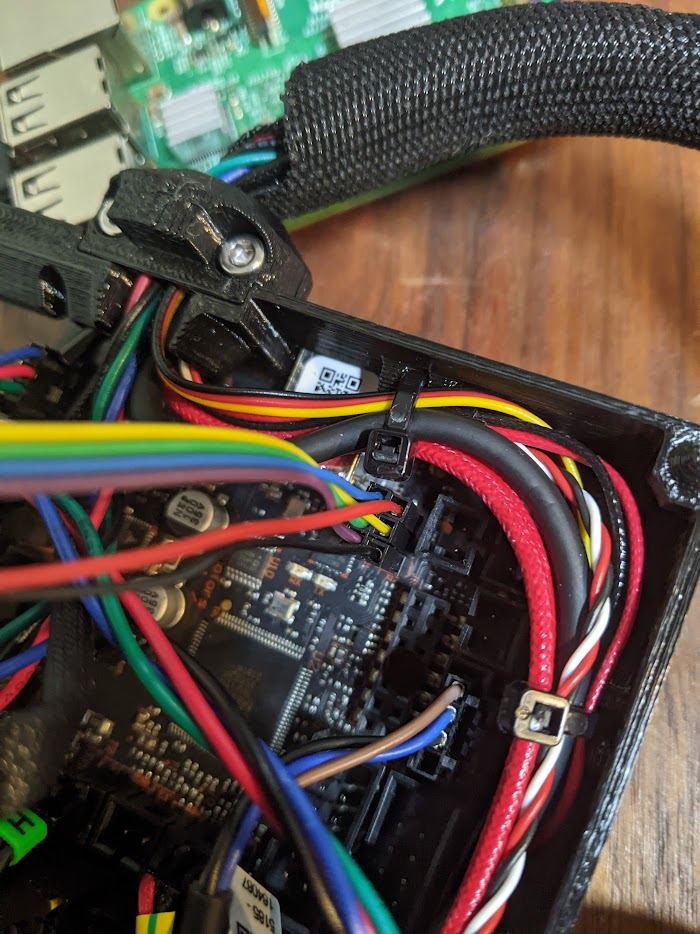
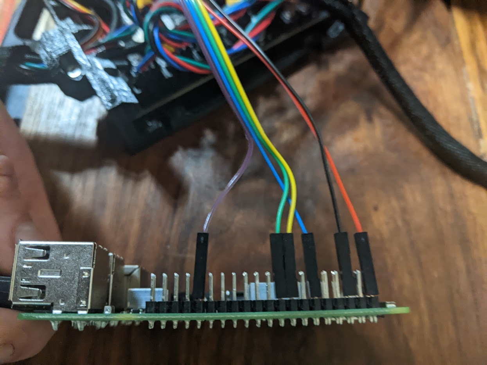

# Prusa Einsy

## Wiring

The Prusa Einsy is currently only compatible with the Prusa MK3S and the stock prusa wiring. Just make sure everything is wired according to the Prusa documentation and you'll be good to go.

## Flashing the bootloader

To use the einsy board with RatOS, you need to flash a DFU bootloader to your board. Follow this guide to flash the bootloader on your Einsy, using the raspberry pi: [Einsy bootloader guide by Prutsium aka Pinky#1302](https://github.com/Prutsium/3D-Druckerplausch-Klipper/wiki/1_Flash_Einsy_USB_bootloader_en)

You'll find reference pictures below of the wiring needed to flash the bootloader.

### Einsy board side pins

[Open Full Size Image](_media/einsy-bootloader-hookup.png)

### Raspberry pi side pins

[Open Full Size Image](_media/pi-bootloader-hookup.png)

## Firmware installation

After flashing the bootloader, follow the steps in the RatOS Configurator at [http://RatOS.local/configure?step=1](http://RatOS.local/configure?step=1).

## I updated klipper and now i get an error!

When you update klipper you might see an error that looks like this:

This is because klipper made changes to a part of the MCU firmware that we use, and something went wrong while automatically flashing your board. Klipper is telling us that the version of klipper running on the Pi is newer than the version running on the MCU. To fix this, we have to flash the board with a new version of the firmware, Follow the steps in the RatOS Configurator at [http://RatOS.local/configure?step=1](http://RatOS.local/configure?step=1).
