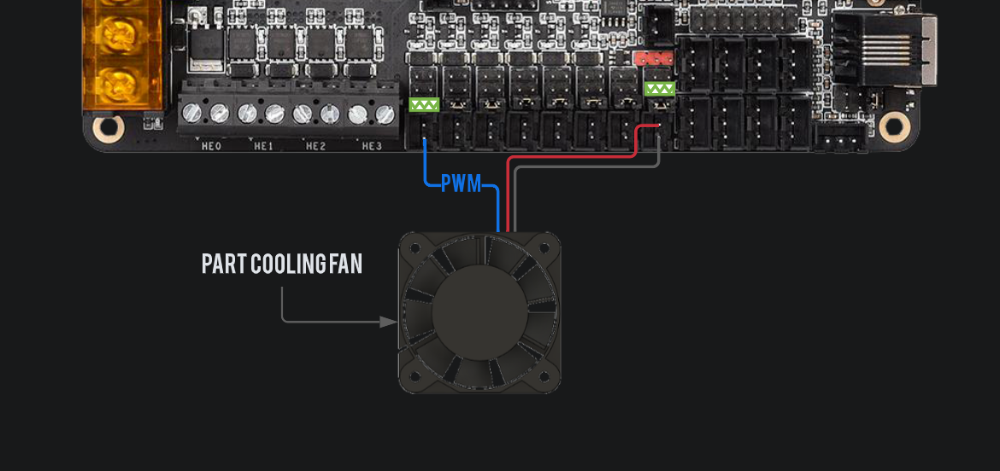

# Connecting a 4028 fan

4028 server fans are becoming a popular option for part cooling because of their light weight and great pressure and flow rates. In this guide we'll go over how to connect one and use it for part cooling. 4-pin fans usually aren't used in 3d printers, and many boards only provide 2-pin ports, but fear not! There's always a way.

## Power
The black and the red pin are for power, you need to connect these to an always on source. Since most of these are 12v, you'll need a 12v source. Boards such as the octopus or the spider come with decent 12v rails on board so you can easily power your 4028 directly from the board via an always-on selectable voltage fan port. Simply connect the red wire to the positive terminal and the black to the negative of the always-on fan port. For other boards without a 12v option, you'll have to use a 12V PSU or a dc/dc converter. If you go that route, be sure to connect the grounds of your 24V PSU and the 12V PSU or dc/dc converter (usually dc/dc converters have the ground pins bridged, so no need to connect the grounds).

## PWM
On Delta fans the blue wire is the PWM wire, on Sanyo's it's the brown wire. If you're unsure, refer to your fans datasheet. To control the 4028's the PWM wire is fed a 5V PWM signal from the board. An easy way to do this is to hook it up to the negative terminal of the part cooling fan port (refer to your boards wiring diagram). We need to invert the logic of the fan_part_cooling_pin to generate a PWM signal the fan can understand. You can do that with the following piece of configuration in your user overrides section.

```properties
[fan]
pin: !fan_part_cooling_pin
```

The wiring would look like this on an Octopus board.



Further more, these fans usually want a 25khz PWM signal to function properly, although some work better with 100hz. Try both and test different fans speeds to find out what works best for your particular fan:

### 25KHZ PWM Signal
```properties
[fan]
pin: !fan_part_cooling_pin
cycle_time: 0.00004
```

### 100HZ PWM Signal
```properties
[fan]
pin: !fan_part_cooling_pin
cycle_time: 0.01
```

## Tachometer
The fourth pin is the tachometer pin, this pin is used to read the RPM of the fan, which, if configured, will be displayed next to the fan speed in Mainsail. You can use any available GPIO on your board for this, if you want, or just leave it disconnected. The following config will enable the tachometer read out:

```properties
[fan]
pin: !fan_part_cooling_pin
cycle_time: 0.00004 # or 0.01
tachometer_pin: ^PD14 # look up your boards pinout diagram to get the pin name for the pin you've chosen
tachometer_poll_interval: 0.0005 # will support up to a 30.000 RPM fan with 2 pulses per rotation.
```

Notice the `^` in front of the pin name, this is a hardware pullup which is generally necessary to read the tachometer signal. For more information on tachometer configuration, refer to the [klipper configuration reference](https://www.klipper3d.org/Config_Reference.html?h=tachometer#fan)

## My fan runs at 100% until klipper boots
This is a safety feature of server fans, they will always run at 100% until they get a PWM signal. It's a bit annoying for 3d printer use, but there's a way around that. You can use the negative terminal of a spare heater port to only power the fan when the board is booted, by connecting the black wire (gnd) to the negative terminal of the heater port. Since these fans run high amperages, it's important that we use a pwm port backed by a properly rated mosfet, which is why the heater ports are perfect. Let's say we connect the gnd wire to the second heater of our board which is controlled by the pin `PA9`, the configuration would be the following:

```properties
[output_pin 4028_POWER]
pin: PA9
value: 1
shutdown_value: 0 # turn the fan power off on MCU shutdown.
```

That's it! Enjoy using your 4028 for excellent part cooling :)

## Bonus: What to look for in a 4028 fan?
CFM isn't everything, we want as much pressure we can get to effectively push the high airflow through our ducts, a good fan is balanced between CFM and pressure. Air pressure is usually expressed in inches of water (in. h2o) or milimeters or pascals, there are online tools to convert between different units, so you can compare the fans before buying, just google "inches of water to pascal" or whatever units you need to convert.

A good performaning 4028 fan will have around 25-30 CFM and over 3 inches of water. For example the `Delta FFB0412UHN-SM36` or the `Sanyo 9GAX0412P3S001`. Take a look at the datasheet for the fan and make sure it runs at low PWM levels, you don't always want high output and it's important that the fan you choose supports low speeds as well as high speeds. Generally you want around a maximumum RPM of 20.000-25.000 to keep the rotor light, extremely fast fans such as the twice as powerful `Delta PFB0412EN-E` needs a heavier rotor and is therefore slower to change speeds. Generally the `Sanyo 9GAX0412P3S001` is regarded as the most well rounded 4028 fan currently, but they can be hard to get, so take a look around and see what you can find, there are many options out there.
